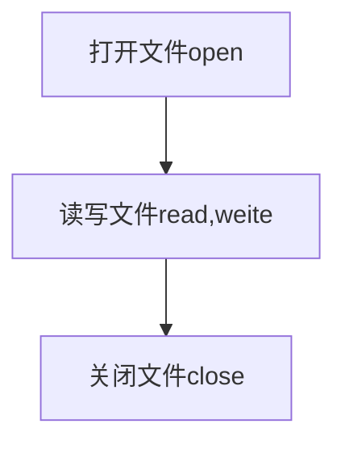

python-2 开始介绍函数

函数方便了程序员，并不会提高程序运行速度，可以理解为复制了一份
## 一、函数的定义与调用
使用def可以定义一个函数

例:

    def printName():
      print("Tom")
    
    printName()#调用printName
    printName()
    
    结果:
    Tom
    Tom
例定义了一个printName函数，我们可以用函数名加()来调用函数，例如printName(),调用的函数会执行定义下的代码，例如printName下的代码时print("Tom"),因此调用后会打印出Tom

## 二、函数的参数与返回值

例(参数):

    def add(a,b):
      print(a+b)
    
    add(1,3)
    结果:4
    add(b=1,a=4)
    结果:5
    
例(返回值):

    def add(a,b):
      return a+b
    
    num =add(1,3)
    结果:num被赋值4
    num =add(b=1,a=4)
    结果:num被赋值5
    
<details><summary>进阶</summary>
<p>
1.我们在定义时，也可以给函数提前赋值，来加强函数的兼容性
<a href="https://github.com/3114aaa/Python-2/blob/main/code/def1.py">代码参考</a>
</p>
<p>。。。</p>
</details>


## 三、内置函数
|内置函数|内置函数|内置函数|内置函数|内置函数|
|-----|---------|------|------------|-----
|abs()|delattr()|hash()|memoryview()|set()
|all()|dict()|help()|min()|setattr()
|any()|dict()|hex()|next()|slice()
|acsii()|divmod()|id()|object()|sorted()
|bin()|enumerate()|input()|oct()|staticmethod()
|bool()|eval()|int()|open()|str()
|breakpoint()|exec()|isinstance()|ord()|sum()
|bytearray()|filter()|issubclass()|pow()|super()
|bytes()|float()|len()|property()|type()
|chr()|frozenset()|list()|range()|vars()
|classmethod()|getattr()|locals()|repr()|zip()
|compile()|globals()|map()|reversed()|\_import\_()
|complex()|hasattr()|max()|round()|

<details><summary>详细用法</summary>
<b>算术函数</b>
<table>
    <tr>
        <td>函数名</td>
        <td>作用</td>
        <td>用法</td>
        <td>结果</td>
    </tr>
    <tr>
        <td>abs()</td>
        <td>绝对值</td>
        <td>abs(-2)</td>
        <td>-2</td>
    </tr>
    <tr>
        <td>divmod()</td>
        <td>取商取余</td>
        <td>divmod(10,3)</td>
        <td>(3,1)</td>
    </tr>
    <tr>
        <td>max()</td>
        <td>取最大值</td>
        <td>max(1,2,3)</td>
        <td>3</td>
    </tr>
    <tr>
        <td>min()</td>
        <td>取最小值</td>
        <td>min(1,2,3)</td>
        <td>1</td>
    </tr>
    <tr>
        <td>pow()</td>
        <td>幂的运算</td>
        <td>pow(2,4)</td>
        <td>16</td>
    </tr>
    <tr>
        <td>round()</td>
        <td>四舍五入</td>
        <td>round(3.14),round(3.14,1)</td>
        <td>3,3.1</td>
    </tr>
    <tr>
        <td>sum()</td>
        <td>求和</td>
        <td>sum((1,2,3)),sum([1,2,3]),sum((1,2,3),-6)</td>
        <td>6,6,0</td>
    </tr>
</table>
<b>数据类型转换函数</b>
<table>
    <tr>
        <td>函数名</td>
        <td>作用</td>
        <td>用法</td>
        <td>结果</td>
    </tr>
    <tr>
        <td>bool()</td>
        <td>布尔型</td>
        <td>bool(1),bool(0),bool(),bool("str")</td>
        <td>True(非零的都为True),False,False,True</td>
    </tr>
    <tr>
        <td>int()</td>
        <td>整型</td>
        <td>int(),int(1.4),int("123")</td>
        <td>0,1,123</td>
    </tr>
    <tr>
        <td>float()</td>
        <td>浮点型</td>
        <td>float(),float(4),float("3")</td>
        <td>0.0,4.0,3.0</td>
    </tr>
    <tr>
        <td>complex()</td>
        <td>复数型(<a url="https://www.zhihu.com/topic/19628033/intro">详情</a>)</td>
        <td>complex(),complex("1+2j",complex(1,2))</td>
        <td>0j,(1+2j),(1+2j)</td>
    </tr>
    <tr>
        <td>str()</td>
        <td>字符串型</td>
        <td>str(),str(123),str(None),str("abc")</td>
        <td>"","123","None","abc"</td>
    </tr>
    <tr>
        <td>ord()</td>
        <td>对字符返回asc码</td>
        <td>ord("a")</td>
        <td>97</td>
    </tr>
    <tr>
        <td>chr()</td>
        <td>将整数转换为asc码对应字符(范围:0-255整数)</td>
        <td>chr(97)</td>
        <td>"a"</td>
    </tr>
    <tr>
        <td>bin()</td>
        <td>将整数转换成二进制</td>
        <td>bin(3)</td>
        <td>0B11</td>
    </tr>
    <tr>
        <td>oct()</td>
        <td>将整数转换八进制</td>
        <td>oct(8)</td>
        <td>0o10</td>
    </tr>
    <tr>
        <td>hex()</td>
        <td>将整数转化为十六进制</td>
        <td>hex(15)</td>
        <td>0xf</td>
    </tr>
</table>
<b>序列函数</b>
<table>
    <tr>
        <td>函数名</td>
        <td>作用</td>
        <td>用法</td>
        <td>结果</td>
    </tr>
    <tr>
        <td>all()</td>
        <td></td>
        <td></td>
        <td></td>
    </tr>
    <tr>
        <td>any()</td>
        <td></td>
        <td></td>
        <td></td>
    </tr>
    <tr>
        <td>filter()</td>
        <td></td>
        <td></td>
        <td></td>
    </tr>
    <tr>
        <td>map()</td>
        <td></td>
        <td></td>
        <td></td>
    </tr>
    <tr>
        <td>reversed()</td>
        <td></td>
        <td></td>
        <td></td>
    </tr>
    <tr>
        <td>sorted()</td>
        <td></td>
        <td></td>
        <td></td>
    </tr>
    <tr>
        <td>zip()</td>
        <td></td>
        <td></td>
        <td></td>
    </tr>
</table>
<b>对象操作</b>
<table>
    <tr>
        <td>函数名</td>
        <td>作用</td>
        <td>用法</td>
        <td>结果</td>
    </tr>
    <tr>
        <td>type()</td>
        <td>返回对象类别</td>
        <td>tpye(True)</td>
        <td>&lt;class 'bool' &gt;</td>
    </tr>
    <tr>
        <td>len()</td>
        <td>返回对象长度</td>
        <td>len("abc"),len((1,2,3)),len([1,2]),len(range(5)),len({'a':12}),len({1,2,3})</td>
        <td>3,3,2,4,1,3</td>
    </tr>
</table>
<b>编译运行</b>
<table>
    <tr>
        <td>函数名</td>
        <td>作用</td>
        <td>用法</td>
        <td>结果</td>
    </tr>
    <tr>
        <td>eval()</td>
        <td>执行字符串</td>
        <td>eval("3+1")</td>
        <td>4</td>
    </tr>
    <tr>
        <td>exec()</td>
        <td>可以执行更难得字符串</td>
        <td>exec('print("123")')</td>
        <td>123</td>
    </tr></table>
</details>

## 四、模块

模块有三类:

- 自带模块
- 自定义模块
- 第三方模块

我们可以使用`import`来导入需要得模块

例如:
```
import math

print(math.e) # 输出e的值
print(math.pow(2,3)) # 输出8
```

有时候我们可能大量用到pow()函数，每次都要math.pow()很麻烦

这时候可以使用`from`,它的作用是直接引用某个模块的函数

例如:

```
from math import pow
print(pow(2,3))
```

或者


```
from math import e,pow
print(e)
print(pow(2,3))
```


```
from math import * 
# *号表示全部直接引用
print(e)
print(pow(2,3))
```

模块_name_属性

当你写代码被导入后，`_name_`的值为模块名

当你写代码直接运行,`_name_`的值为`_main_`

对于模块的运用就先讲到这里，以后会具体对每一块模块讲解

## 五、文件输入输出

文件操作基本步骤



格式
`
变量名 = open(文件名（字符串）[,打开方式])
`

- r:只读
- w:只写
- a:追加
- b:以二进制打开
- \+:读写


**[返回目录](https://github.com/3114aaa/Python-directory)
[下一章](https://github.com/3114aaa/Python-3)**
